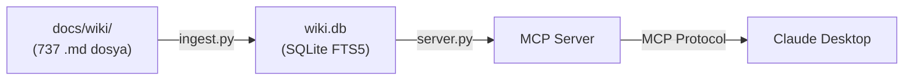
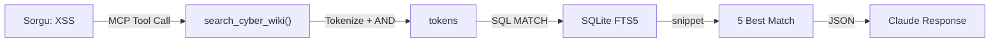
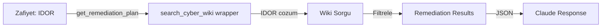
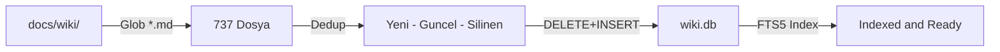
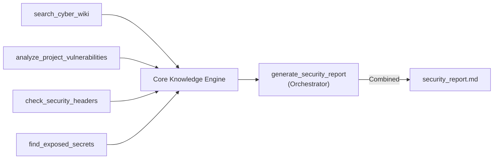

# SiberSelma 🕵️‍♀️

SiberSelma, Claude ve diğer yapay zeka asistanlarına siber güvenlik bilgisi kazandıran açık kaynaklı bir **MCP (Model Context Protocol)** sunucusudur. 737'den fazla siber güvenlik dokümanını indeksleyerek asistanın sorularınızı wiki tabanlı bir bilgi bankasıyla yanıtlamasını sağlar.

---

## Mevcut Tool'lar

| Tool | Açıklama | Durum |
|------|----------|-------|
| `search_cyber_wiki` | 737 wiki dosyasında tam metin arama | ✅ Aktif |
| `get_remediation_plan` | Zafiyet için wiki'den çözüm planı getirir | ✅ Aktif |
| `analyze_project_vulnerabilities` | Proje kodlarını statik analiz eder (SAST) | 🔜 Yakında |
| `run_basic_pentest` | Hedef URL/IP üzerinde pentest taraması | 🔜 Yakında |
| `check_security_headers` | Sitenin HTTP güvenlik header'larını kontrol eder | 🔜 Yakında |
| `check_dependencies` | Bağımlılıkları CVE veritabanıyla karşılaştırır | 🔜 Yakında |
| `find_exposed_secrets` | Kodda hardcode API key / token / şifre arar | 🔜 Yakında |
| `generate_security_report` | Tüm analizleri birleştirip rapor üretir | 🔜 Yakında |

### Planlanan Harici API Entegrasyonları

| Entegrasyon | Amaç |
|-------------|------|
| NVD API | Server başlarken otomatik CVE taraması |
| Have I Been Pwned | Kullanıcı mail/şifre sızıntısı kontrolü |
| VirusTotal | URL ve domain taraması |
| MITRE ATT&CK | Saldırı taktikleri ve teknikleri |
| AlienVault OTX | IP/domain tehdit geçmişi |
| crt.sh | SSL loglarından subdomain keşfi |
| Wayback Machine | Eski site versiyonlarında açık taraması |
| RSS (THN, BleepingComputer) | Günlük güvenlik haberleri otomatik wiki'ye eklenir |

---

## Kurulum

### 1. Repoyu Klonla

```bash
git clone https://github.com/tasdeleno/SiberSelma.git
cd SiberSelma
```

### 2. Sanal Ortam Kur ve Bağımlılıkları Yükle

```bash
python -m venv venv

# Windows
.\venv\Scripts\activate

# macOS / Linux
source venv/bin/activate

pip install -r requirements.txt
```

### 3. Wiki Dosyalarını İndeksle

`docs/wiki/` klasöründeki tüm `.md` dosyaları SQLite FTS5 ile indekslenir:

```bash
python ingest.py
```

Başarılı çıktı:
```
'docs\wiki' içerisindeki dosyalar taranıyor...

[SUMMARY] Indexing Complete:
  [+] 737 yeni dosya eklendi
  [~] 0 dosya guncellendi
  [-] 0 dosya silindi
  [*] Toplam: 737 dosya

[OK] SiberSelma sunucusu (server.py) hazir.
```

---

## Claude Desktop'a Bağlama

`%APPDATA%\Claude\claude_desktop_config.json` dosyasını açıp şu satırları ekle:

```json
{
  "mcpServers": {
    "SiberSelma": {
      "command": "python",
      "args": ["C:\\tam\\yol\\SiberSelma\\server.py"]
    }
  }
}
```

> macOS/Linux için `args` içinde `/tam/yol/SiberSelma/server.py` yaz.

Dosyayı kaydedip **Claude Desktop'ı yeniden başlat.**

---

## Kullanım

Claude Desktop açıkken herhangi bir konuşmada:

### Wiki'de Arama

```
@SiberSelma search_cyber_wiki "XSS"
@SiberSelma search_cyber_wiki "SQL Injection bypass"
@SiberSelma search_cyber_wiki "SSRF cloud metadata"
```

### Zafiyet Çözüm Planı

```
@SiberSelma get_remediation_plan "IDOR"
@SiberSelma get_remediation_plan "CSRF"
@SiberSelma get_remediation_plan "SQL Injection"
```

### Örnek Çıktı

```
=== Kaynak: README.md ===
# Server-Side Request Forgery

SSRF is a vulnerability in which an attacker forces a server to
perform requests on their behalf...

=== Kaynak: SSRF_Prevention_Cheat_Sheet.md ===
## Mitigation
- Validate and sanitize all user-supplied URLs
- Use allowlists for permitted domains...
```

---

## 📊 Nasıl Çalışıyor?

### Genel Mimari



SiberSelma üç aşamada çalışır:
1. **İndeksleme** (`ingest.py`): Wiki dosyaları SQLite FTS5 ile indekslenir
2. **Sunucu** (`server.py`): MCP protokolü üzerinden tool'ları sunar
3. **İstemci** (Claude Desktop): Claude bu tool'ları sorgulanırken çağırır

---

### Tool Workflow'ları

#### 1️⃣ Arama Workflow (search_cyber_wiki)



**Adımlar:**
- Kullanıcı soru sorar: *"@SiberSelma search_cyber_wiki 'XSS'"*
- Query tokenize edilir: `"XSS"` → `['XSS']`
- SQLite FTS5 MATCH operatörü indeksen arama yapar
- İlk 5 en uygun dosya snippet'i ile döndürülür
- Claude yanıtını bu bilgiyle oluşturur

---

#### 2️⃣ Çözüm Planı Workflow (get_remediation_plan)



**Adımlar:**
- `get_remediation_plan("IDOR")` çağrılır
- Arka planda `search_cyber_wiki("IDOR çözüm")` tetiklenir
- Wiki'den zafiyet çözüm planları getirilir
- Claude bunu çözüm önerileriyle sunabilir

---

#### 3️⃣ İndeksleme Workflow (ingest.py)



**Adımlar:**
- `python ingest.py` çalıştırılır
- `docs/wiki/` içindeki tüm `.md` dosyaları bulunur
- Veritabanındaki mevcut kayıtlarla karşılaştırılır (deduplikasyon)
- Yeni dosyalar eklenir, mevcut dosyalar güncellenir, silinmiş dosyalar kaldırılır
- FTS5 otomatik olarak tokenize ve indeksler

---

#### 4️⃣ Gelecek: Güvenlik Raporu Orchestrasyon



Tüm tool'lar tek raporda birleştirilecek:
- Kod zafiyetleri (SAST)
- HTTP header kontrolleri
- Sırlar/credential'lar
- Wiki referansları
- Bir `security_report_YYYY-MM-DD.md` üretilecek

---

### FTS5 Arama Mekanizması

SQLite FTS5 (Full-Text Search 5) tam metin araması yapar:

| Kavram | Açıklama |
|--------|----------|
| **Tokenize** | "SQL Injection" → `["SQL", "Injection"]` |
| **MATCH** | `wiki_search MATCH '"SQL" AND "Injection"'` |
| **Rank** | En uygun sonuç ilk sırada |
| **Snippet** | Sonuç metni etrafındaki 64 karakterlik kontekst |

---

## Wiki Kaynakları

`docs/wiki/` içinde şu kaynaklar indekslenmiştir:

- **PayloadsAllTheThings** — 60+ zafiyet tipi için payload ve exploit örnekleri
- **OWASP Cheat Sheets** — SQL Injection, XSS, CSRF ve daha fazlası için önleme rehberleri
- **h4cker** — Web, bulut, AI güvenliği, red team, DFIR
- **Awesome Asset Discovery** — Keşif ve OSINT araçları
- **90 Days of Cybersecurity** — Temelden ileri seviyeye öğrenme yolu
- **Awesome ML for Cybersecurity** — Siber güvenlikte makine öğrenmesi kaynakları

---

## Proje Yapısı

```
SiberSelma/
├── server.py        # MCP sunucusu (FastMCP)
├── ingest.py        # Wiki dosyalarını SQLite'a indeksler
├── wiki.db          # FTS5 arama veritabanı (ingest.py ile oluşur, .gitignore'da)
├── CLAUDE.md        # Proje durumu ve yapılacaklar (AI session rehberi)
├── requirements.txt
└── docs/
    └── wiki/        # 737+ siber güvenlik markdown dosyası
        ├── PayloadsAllTheThings/
        ├── h4cker-master/
        ├── cheatsheets/
        └── ...
```

---

## Katkı

`docs/wiki/` klasörüne yeni `.md` dosyası ekleyip `python ingest.py` çalıştırman yeterli — Claude anında o bilgiye erişebilir.

1. Bu repoyu fork'la
2. `docs/wiki/` klasörüne yeni markdown dosyaları ekle
3. `python ingest.py` ile yeniden indeksle
4. Pull request gönder

---

## Lisans

MIT License
