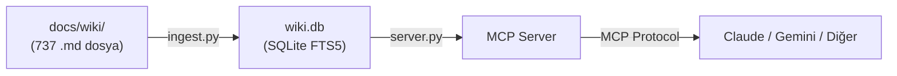
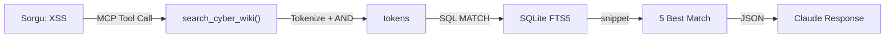
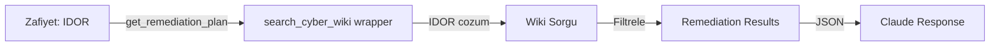
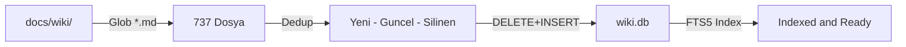
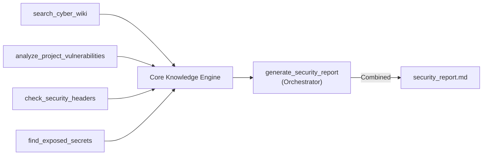

# SiberSelma 🕵️‍♀️

SiberSelma, **Gemini**, **Claude** ve diğer yapay zeka asistanlarına siber güvenlik bilgisi kazandıran açık kaynaklı bir **MCP (Model Context Protocol)** sunucusudur. 737'den fazla siber güvenlik dokümanını indeksleyerek asistanın sorularınızı wiki tabanlı bir bilgi bankasıyla yanıtlamasını sağlar.

---

## Mevcut Tool'lar

| Tool | Açıklama | Durum |
|------|----------|-------|
| `search_cyber_wiki` | 737 wiki dosyasında tam metin arama (AND + OR fallback) | ✅ Aktif |
| `get_remediation_plan` | Zafiyet için wiki'den çözüm planı getirir | ✅ Aktif |
| `analyze_project_vulnerabilities` | .py/.js/.ts dosyalarında 17 tehlikeli pattern tarayan SAST tarayıcı | ✅ Aktif |
| `run_basic_pentest` | HTTP header, cookie, form, sunucu bilgisi güvenlik analizi | ✅ Aktif |
| `check_security_headers` | 10 güvenlik header kontrolü + skor + bilgi sızıntısı tespiti | ✅ Aktif |
| `check_dependencies` | NVD API ile bağımlılık CVE taraması (CVSS skorlarıyla) | ✅ Aktif |
| `find_exposed_secrets` | 12 pattern ile hardcode secret tarama + .env git kontrolü | ✅ Aktif |
| `generate_security_report` | Tüm tool'ları çalıştırıp kritik/yüksek/orta özeti ile `security_report_YYYY-MM-DD.md` üretir | ✅ Aktif |

### Harici API Tool'ları

| Tool | API | Açıklama |
|------|-----|----------|
| `find_subdomains(domain)` | crt.sh | SSL loglarından subdomain keşfi (key gerektirmez) |
| `check_history(url)` | Wayback Machine | Eski versiyonlarda açık endpoint/config taraması |
| `check_threat(ip_or_domain)` | AlienVault OTX | IP/domain tehdit geçmişi, pulse sayısı |
| `get_attack_techniques(vuln)` | MITRE ATT&CK | Zafiyet için saldırgan taktik ve teknikleri |
| `check_breach(email)` | Have I Been Pwned | Mail veri ihlali kontrolü (HIBP_API_KEY gerekir) |
| `fetch_security_news(n)` | THN + BleepingComputer | RSS → `docs/wiki/news/` otomatik kayıt |

---

## Kurulum

### 1. Repoyu Klonla

```bash
git clone https://github.com/tasdeleno/SiberSelma.git
cd SiberSelma
```

### 2. Sanal Ortam Kur ve Bağımlılıkları Yükle

```bash
python -m venv venv

# Windows
.\venv\Scripts\activate

# macOS / Linux
source venv/bin/activate

pip install -r requirements.txt
```

### 3. Wiki Dosyalarını İndeksle

`docs/wiki/` klasöründeki tüm `.md` dosyaları SQLite FTS5 ile indekslenir:

```bash
python ingest.py
```

Başarılı çıktı:
```
'docs\wiki' içerisindeki dosyalar taranıyor...

[SUMMARY] Indexing Complete:
  [+] 737 yeni dosya eklendi
  [~] 0 dosya guncellendi
  [-] 0 dosya silindi
  [*] Toplam: 737 dosya

[OK] SiberSelma sunucusu (server.py) hazir.
```

---

## Desteklenen Platformlar

SiberSelma, MCP (Model Context Protocol) standardını kullanır. MCP destekleyen **tüm AI istemcileriyle** çalışır:

| Platform | Konfigürasyon Dosyası | Durum |
|----------|----------------------|-------|
| Claude Desktop | `%APPDATA%\Claude\claude_desktop_config.json` | ✅ Destekleniyor |
| Gemini CLI | `%USERPROFILE%\.gemini\settings.json` | ✅ Destekleniyor |
| Claude Code (CLI) | Otomatik (stdio) | ✅ Destekleniyor |
| Diğer MCP İstemcileri | İstemciye göre değişir | ✅ Destekleniyor |

---

### Önemli: Kurulum Yolu Seçimi

> **Windows kullanıcıları için kritik not:** Repoyu `Masaüstü` (Desktop) gibi Türkçe karakter içeren bir dizine klonlamayın. JSON config dosyaları bu karakterleri yanlış kodlayarak `Masaüstü` gibi bozuk yollara dönüştürebilir — bu durumda MCP sunucu başlatılamaz.
>
> **Önerilen kurulum yolu:** `C:\SiberSelma\` veya `C:\Users\kullanici\SiberSelma\`

---

### Claude Desktop Kurulumu

`%APPDATA%\Claude\claude_desktop_config.json` dosyasını açıp şu satırları ekle:

**Windows:**
```json
{
  "mcpServers": {
    "SiberSelma": {
      "command": "C:\\Users\\kullanici\\AppData\\Local\\Programs\\Python\\Python314\\python.exe",
      "args": ["C:\\SiberSelma\\server.py"]
    }
  }
}
```

**macOS / Linux:**
```json
{
  "mcpServers": {
    "SiberSelma": {
      "command": "python3",
      "args": ["/home/kullanici/SiberSelma/server.py"]
    }
  }
}
```

> `python.exe` yolunu bulmak için terminalde `where python` (Windows) veya `which python3` (macOS/Linux) çalıştır.
>
> Zaten başka MCP sunucuların varsa, `mcpServers` içine yalnızca `"SiberSelma": { ... }` bloğunu eklemen yeterli.

Dosyayı kaydedip **Claude Desktop'ı yeniden başlat.**

---

### Gemini CLI Kurulumu

`%USERPROFILE%\.gemini\settings.json` (macOS/Linux: `~/.gemini/settings.json`) dosyasını aç veya oluştur:

**Windows:**
```json
{
  "mcpServers": {
    "SiberSelma": {
      "command": "C:\\Users\\kullanici\\AppData\\Local\\Programs\\Python\\Python314\\python.exe",
      "args": ["C:\\SiberSelma\\server.py"]
    }
  }
}
```

**macOS / Linux:**
```json
{
  "mcpServers": {
    "SiberSelma": {
      "command": "python3",
      "args": ["/home/kullanici/SiberSelma/server.py"]
    }
  }
}
```

Doğrulama:
```bash
# Gemini CLI'da mevcut MCP sunucularını listele
/mcp list

# SiberSelma tool'larını test et
@SiberSelma search_cyber_wiki "XSS"
```

---

### Diğer MCP İstemcileri

SiberSelma standart **stdio** transport kullanır. MCP destekleyen herhangi bir istemciye bağlamak için:

```bash
# Sunucuyu doğrudan çalıştır (stdio üzerinden iletişim kurar)
python server.py
```

İstemcinizin MCP konfigürasyonuna `command: "python"` ve `args: ["server.py yolu"]` ekleyin.

---

## Kullanım

SiberSelma tool'ları Claude Desktop, Gemini CLI veya herhangi bir MCP istemcisinde aynı şekilde çalışır.

### Wiki'de Arama

```
@SiberSelma search_cyber_wiki "XSS"
@SiberSelma search_cyber_wiki "SQL Injection bypass"
@SiberSelma search_cyber_wiki "SSRF cloud metadata"
```

### Zafiyet Çözüm Planı

```
@SiberSelma get_remediation_plan "IDOR"
@SiberSelma get_remediation_plan "CSRF"
```

### Subdomain Keşfi

```
@SiberSelma find_subdomains "example.com"
```

### MITRE ATT&CK Teknik Arama

```
@SiberSelma get_attack_techniques "phishing"
```

---

## 📋 Kapsamlı Güvenlik Raporu (generate_security_report)

`generate_security_report` tüm SiberSelma tool'larını sırayla çalıştırarak tek bir kapsamlı rapor üretir. Rapor `security_report_YYYY-MM-DD.md` olarak proje dizinine kaydedilir.

### Ne yapar?

Tek bir komutla şu analizler otomatik çalışır:

| Adım | Analiz | Detay |
|------|--------|-------|
| 1 | **Web Uygulama Analizi** | HTTP header, cookie, form, sunucu bilgi sızıntısı |
| 2 | **Statik Kod Analizi (SAST)** | .py/.js/.ts dosyalarında 17 tehlikeli pattern |
| 3 | **HTTP Güvenlik Header'ları** | 10 header kontrolü + güvenlik skoru |
| 4 | **Bağımlılık CVE Analizi** | NVD API ile requirements.txt/package.json taraması |
| 5 | **Hardcoded Secret Tarama** | API key, token, şifre, private key + .env kontrolü |

Rapor sonunda **Kritik / Yüksek / Orta** seviye özet tablosu ve öncelikli düzeltme adımları yer alır.

### Claude Desktop'ta Kullanım

Claude Desktop'ta SiberSelma tool'ını doğal dille çağırabilirsiniz:

```
Benim web sitemin güvenlik raporunu çıkar.
URL: https://example.com
Proje dizini: C:\Users\kullanici\projeler\web-app
```

Veya doğrudan tool çağrısı:

```
@SiberSelma generate_security_report "https://example.com" "C:\Users\kullanici\projeler\web-app"
```

### Gemini CLI'da Kullanım

Gemini CLI'da da aynı şekilde çalışır:

```
@SiberSelma generate_security_report "https://example.com" "/home/kullanici/projeler/web-app"
```

Veya doğal dille:

```
SiberSelma'yı kullanarak https://mysite.com sitesinin ve /home/user/mysite
projesinin güvenlik raporunu oluştur.
```

### Örnek Rapor Çıktısı

```markdown
# Güvenlik Raporu — 2026-05-06
**Hedef URL:** https://example.com
**Proje Dizini:** /home/user/myproject
**Oluşturulma:** 2026-05-06 14:30

---

## Özet
| Seviye | Sayı |
|--------|------|
| 🔴 Kritik | 2 |
| 🟠 Yüksek | 3 |
| 🟡 Orta | 5 |

### Öncelikli Düzeltme Adımları
1. Hardcoded secret ve CVE bulunan bağımlılıkları acilen temizle
2. SAST bulgularındaki yüksek riskli kod pattern'lerini düzelt
3. Eksik HTTP güvenlik header'larını ekle

---

## 1. Web Uygulama Analizi
**HTTP Durum:** 200 OK
### Güvenlik Header'ları
**Eksik (5):** `Content-Security-Policy`, `Permissions-Policy`, ...

## 2. Statik Kod Analizi (SAST)
## SAST Tarama Sonucu — 6 bulgu, 23 dosya tarandı
- **SQL_Injection** | `api/db.py:45` | SQL string formatting
  `cursor.execute(f"SELECT * FROM users WHERE id={user_id}")`

## 3. HTTP Güvenlik Header'ları
**Güvenlik Skoru:** 40/100 (4/10 header mevcut)

## 4. Bağımlılık CVE Analizi
### flask — 3 CVE bulundu
  - **CVE-2024-XXXXX** (CVSS: 7.5) — ...

## 5. Hardcoded Secret Tarama
### Bulunan Secret'lar (1)
- **Hardcoded API key** | `config.py:12`
  `api_key = "***REDACTED***"`
```

> **Not:** Rapor otomatik olarak `security_report_2026-05-06.md` olarak proje kök dizinine kaydedilir.

### Diğer Tool Kullanım Örnekleri

```bash
# Tek bir sitenin header kontrolü
@SiberSelma check_security_headers "https://example.com"

# Proje kodunda secret tarama
@SiberSelma find_exposed_secrets "C:\Users\kullanici\projeler\web-app"

# Bağımlılıklarda bilinen CVE kontrolü
@SiberSelma check_dependencies "C:\Users\kullanici\projeler\web-app\requirements.txt"

# IP/domain tehdit kontrolü
@SiberSelma check_threat "suspicious-domain.com"

# E-posta veri ihlali kontrolü (HIBP_API_KEY gerekir)
@SiberSelma check_breach "user@example.com"

# Güncel siber güvenlik haberleri
@SiberSelma fetch_security_news 5

# Wayback Machine ile geçmiş analizi
@SiberSelma check_history "https://example.com/.env"
```

---

## 📊 Nasıl Çalışıyor?

### Genel Mimari



SiberSelma üç aşamada çalışır:
1. **İndeksleme** (`ingest.py`): Wiki dosyaları SQLite FTS5 ile indekslenir
2. **Sunucu** (`server.py`): MCP protokolü üzerinden tool'ları sunar
3. **İstemci** (Claude Desktop, Gemini CLI, vb.): AI asistan bu tool'ları sorgulanırken çağırır

---

### Tool Workflow'ları

#### 1️⃣ Arama Workflow (search_cyber_wiki)



**Adımlar:**
- Kullanıcı soru sorar: *"@SiberSelma search_cyber_wiki 'XSS'"*
- Query tokenize edilir: `"XSS"` → `['XSS']`
- Önce AND ile aranır, sonuç yoksa OR fallback devreye girer
- İlk 5 en uygun dosya snippet'i ile döndürülür
- Claude yanıtını bu bilgiyle oluşturur

---

#### 2️⃣ Çözüm Planı Workflow (get_remediation_plan)



**Adımlar:**
- `get_remediation_plan("IDOR")` çağrılır
- Arka planda `search_cyber_wiki("IDOR çözüm")` tetiklenir
- Wiki'den zafiyet çözüm planları getirilir
- Claude bunu çözüm önerileriyle sunabilir

---

#### 3️⃣ İndeksleme Workflow (ingest.py)



**Adımlar:**
- `python ingest.py` çalıştırılır
- `docs/wiki/` içindeki tüm `.md` dosyaları bulunur
- Veritabanındaki mevcut kayıtlarla karşılaştırılır (deduplikasyon)
- Yeni dosyalar eklenir, mevcut dosyalar güncellenir, silinmiş dosyalar kaldırılır
- FTS5 otomatik olarak tokenize ve indeksler

---

#### 4️⃣ Gelecek: Güvenlik Raporu Orchestrasyon



Tüm tool'lar tek raporda birleştirilecek:
- Kod zafiyetleri (SAST)
- HTTP header kontrolleri
- Sırlar/credential'lar
- Wiki referansları
- Bir `security_report_YYYY-MM-DD.md` üretilecek

---

### FTS5 Arama Mekanizması

SQLite FTS5 (Full-Text Search 5) tam metin araması yapar:

| Kavram | Açıklama |
|--------|----------|
| **Tokenize** | "SQL Injection" → `["SQL", "Injection"]` |
| **MATCH** | `wiki_search MATCH '"SQL" AND "Injection"'` |
| **Rank** | En uygun sonuç ilk sırada |
| **Snippet** | Sonuç metni etrafındaki 64 karakterlik kontekst |

---

## Wiki Kaynakları

`docs/wiki/` içinde şu kaynaklar indekslenmiştir:

- **PayloadsAllTheThings** — 60+ zafiyet tipi için payload ve exploit örnekleri
- **OWASP Cheat Sheets** — SQL Injection, XSS, CSRF ve daha fazlası için önleme rehberleri
- **h4cker** — Web, bulut, AI güvenliği, red team, DFIR
- **Awesome Asset Discovery** — Keşif ve OSINT araçları
- **90 Days of Cybersecurity** — Temelden ileri seviyeye öğrenme yolu
- **Awesome ML for Cybersecurity** — Siber güvenlikte makine öğrenmesi kaynakları

---

## Proje Yapısı

```
SiberSelma/
├── server.py        # MCP sunucusu (FastMCP)
├── ingest.py        # Wiki dosyalarını SQLite'a indeksler
├── wiki.db          # FTS5 arama veritabanı (ingest.py ile oluşur, .gitignore'da)
├── CLAUDE.md        # Proje durumu ve yapılacaklar (AI session rehberi)
├── requirements.txt
└── docs/
    └── wiki/        # 737+ siber güvenlik markdown dosyası
        ├── PayloadsAllTheThings/
        ├── h4cker-master/
        ├── cheatsheets/
        └── ...
```

---

## Sık Karşılaşılan Sorunlar

### MCP sunucu bağlanamıyor / "No such file or directory"

**Belirti:** Claude Desktop veya Gemini CLI loglarında şu hata görünür:
```
can't open file 'C:\Users\...\Masaüstü\SiberSelma\server.py': [Errno 2] No such file or directory
```

**Sebep:** `Masaüstü` gibi Türkçe karakter içeren bir dizinde kurulu olması. JSON config dosyası "ü" karakterini `ü` olarak bozuk kodlar.

**Çözüm:**
1. Repoyu Türkçe karakter içermeyen bir yola taşı (örn. `C:\SiberSelma\`)
2. Config dosyasını güncellenmiş yolla tekrar yaz
3. İstemciyi yeniden başlat

---

### `python` komutu bulunamıyor

Config'de `"command": "python"` yerine Python'un tam yolunu kullan:

```
# Windows — tam yolu bulmak için:
where python

# macOS/Linux
which python3
```

---

### wiki.db yok / arama sonuç vermiyor

`wiki.db` `.gitignore`'da olduğu için repoda bulunmaz. İlk kurulumda ve wiki güncellemelerinden sonra çalıştır:

```bash
python ingest.py
```

---

## Katkı

`docs/wiki/` klasörüne yeni `.md` dosyası ekleyip `python ingest.py` çalıştırman yeterli — Claude anında o bilgiye erişebilir.

1. Bu repoyu fork'la
2. `docs/wiki/` klasörüne yeni markdown dosyaları ekle
3. `python ingest.py` ile yeniden indeksle
4. Pull request gönder

---

## Lisans

MIT License
